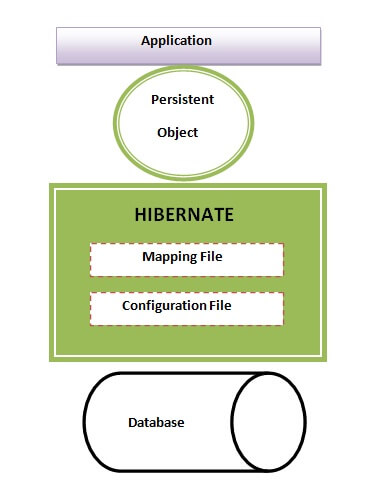
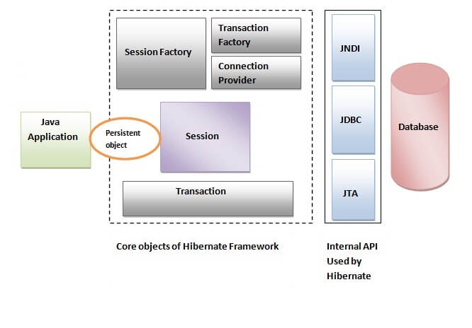

#Hibernate
The Hibernate architecture is categorized in four layers.
1. Java application layer 
2. Hibernate framework layer
3. Backhand api layer
4. Database layer

This is the high level architecture of Hibernate with mapping file and configuration file.

##Elements of Hibernate Architecture
For creating the first hibernate application, we must know the elements of Hibernate architecture. They are as follows:
1. **SessionFactory** : The SessionFactory is a factory of session and client of ConnectionProvider. It holds second
level cache (optional) of data. The org.hibernate.SessionFactory interface provides factory method to get the object of Session.
2. **Session** :The session object provides an interface between the application and data stored in the database.
It is a short-lived object and wraps the JDBC connection. It is factory of Transaction, Query and Criteria. It holds a first-level cache (mandatory) of data. The org.hibernate.Session interface provides methods to insert, update and delete the object. It also provides factory methods for Transaction, Query and Criteria.
3. **Transaction**: The transaction object specifies the atomic unit of work. It is optional. The org.hibernate.
Transaction interface provides methods for transaction management.
4. **ConnectionProvider**: It is a factory of JDBC connections. It abstracts the application from DriverManager or
DataSource. It is optional.
5. **TransactionFactory**: It is a factory of Transaction. It is optional.